# i3 配置说明：这些 app 分别做什么

这份文档是给“以后忘了这些程序各自干什么”时看的。它不是安装教程，而是这套桌面环境的结构图和排查地图。

先记住一句话：

```text
i3 管窗口和启动
polybar 管顶部栏
picom 管视觉特效
rofi 管弹出菜单
kitty 管终端
gjs 管自定义通知
脚本负责自动化和连接
```

## 总览图

这套桌面不是一个大程序，而是一组小程序拼起来的。`i3` 是入口，其他程序围绕它工作。

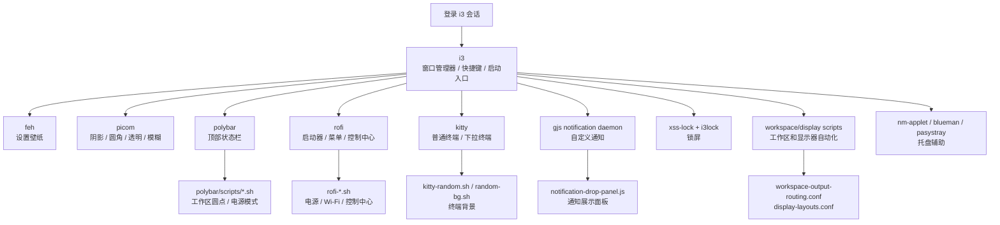

如果只想理解视觉效果，重点看这条链：

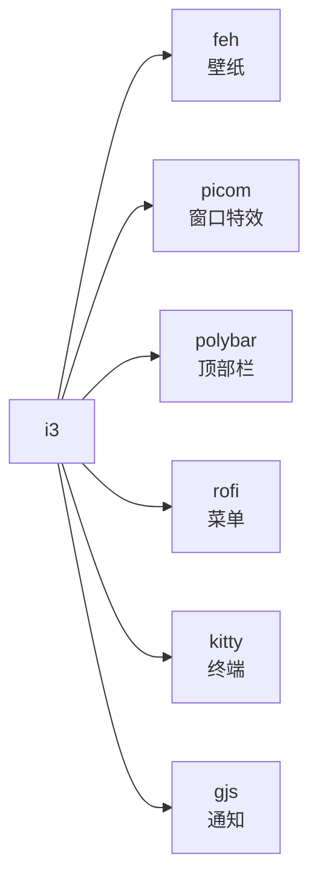

## 核心组件速查

| app | 负责什么 | 出问题时的表现 |
| --- | --- | --- |
| `i3` | 窗口平铺、浮动、快捷键、工作区、启动其他服务 | 窗口布局、快捷键、工作区都异常 |
| `polybar` | 顶部状态栏、时间、工作区圆点、CPU、内存、电池、Wi-Fi、托盘 | 顶部栏消失，系统状态不显示 |
| `picom` | 合成器，负责阴影、圆角、透明、模糊、动画 | 窗口变硬，没有圆角/阴影/模糊 |
| `rofi` | 弹出菜单：应用启动器、电源菜单、Wi-Fi、控制中心 | 菜单打不开或样式不对 |
| `kitty` | 终端，包含普通终端和下拉终端 | `Super+Enter` 或下拉终端打不开 |
| `feh` | 设置壁纸 | 壁纸不对或没有壁纸 |
| `gjs` | 运行 JavaScript 桌面小程序，这里负责自定义通知 | 通知不弹出或通知面板异常 |
| `xrandr` | 查询和设置显示器布局 | 显示器切换、外屏位置不对 |
| `jq` | 解析 i3 输出的 JSON | 工作区脚本、polybar 工作区圆点异常 |

## i3 是调度器

`config/i3/config` 是入口文件。它不只是 i3 的外观配置，还负责把其他程序启动起来。

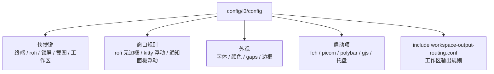

换句话说：如果不知道某个东西为什么会启动，先去 `config/i3/config` 里找。

## 启动链路

登录 i3 后，大致启动顺序如下。

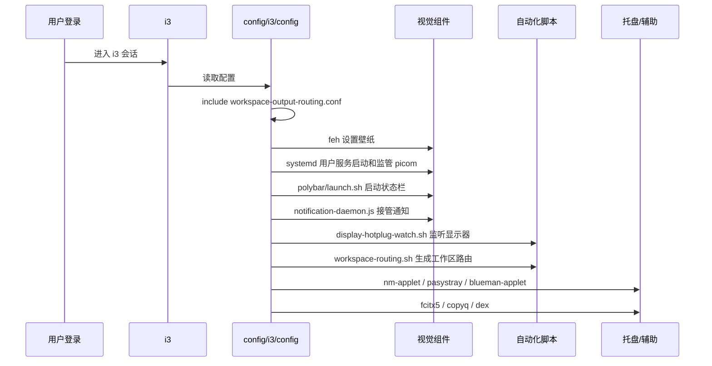

不是每一项都必须。核心视觉效果主要依赖：

```text
i3 + polybar + picom + rofi + kitty + feh + gjs
```

## 顶部栏：polybar

`polybar` 负责你屏幕顶部那条栏。

当前栏宽使用每块显示器的 `100%`。这是为了让 Polybar 窗口与 i3 管理的 dock 容器宽度一致，避免 `98%` 浮动栏在右侧留下黑色或浅色尾块，同时保留工作区避让和 tray 稳定性。Polybar 的左、中、右模块布局不能根据当前内容自动收缩整条栏。

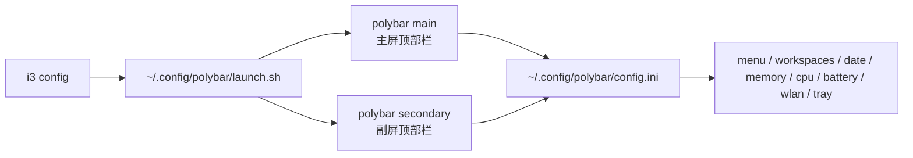

当前模块：

| 模块 | 作用 | 来源 |
| --- | --- | --- |
| `menu` | 左侧图标，点击打开 rofi 应用启动器 | `config.ini` |
| `workspaces` | 工作区圆点 | `polybar/scripts/i3-workspaces.sh` |
| `date` | 中间时间胶囊 | polybar 内置 date |
| `memory` | 内存占用 | polybar 内置 memory |
| `cpu` | CPU 占用 | polybar 内置 cpu |
| `battery` | 电池状态 | polybar 内置 battery |
| `power-profile` | 电源模式 | `polybar/scripts/power-profile.sh` |
| `wlan` | Wi-Fi 状态 | polybar 内置 network |
| `tray` | 系统托盘 | polybar 内置 tray |

顶部栏不见时，先看：

```text
~/.config/polybar/launch.sh
~/.config/polybar/config.ini
/tmp/polybar-main.log
```

## 窗口特效：picom

`picom` 负责视觉质感：阴影、圆角、透明、模糊、淡入淡出。

这里没有让 i3 直接托管 `picom`，而是启动两个 systemd 用户服务：

```text
picom.service
picom-power-watch.service
```

`picom.service` 运行 `~/.config/i3/picom-launcher.sh`，根据电源状态选择配置，并在 Picom 异常退出时自动恢复。`picom-power-watch.service` 使用阻塞式 `udevadm monitor` 监听电源事件，空闲时不进行周期轮询。

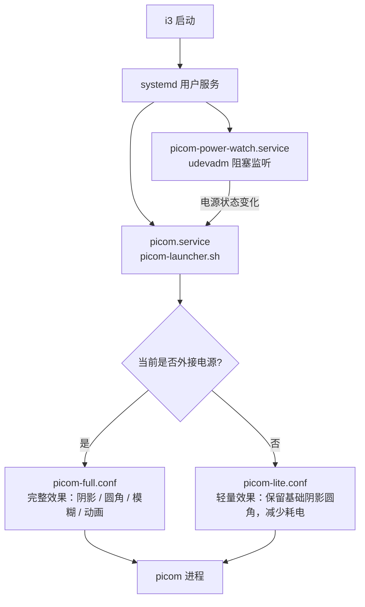

窗口没有圆角、阴影、模糊时，先看：

```text
picom 是否运行
systemctl --user status picom.service picom-power-watch.service
/tmp/picom.log
~/.config/picom/picom-full.conf
~/.config/picom/picom-lite.conf
```

## 弹出菜单：rofi

`rofi` 负责所有弹出来的菜单和选择器。

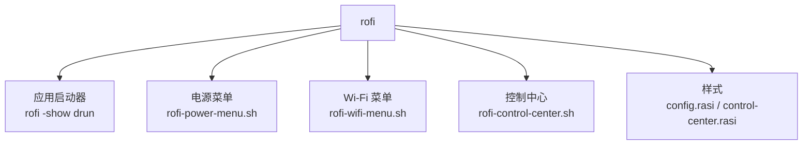

常见入口：

| 入口 | 作用 |
| --- | --- |
| `Mod1+Space` | 应用启动器 |
| `Super+Escape` | 电源菜单 |
| 点击 polybar Wi-Fi | Wi-Fi 菜单 |
| 点击控制中心模块 | 控制中心 |

如果菜单能打开但样式不对，看：

```text
~/.config/rofi/config.rasi
~/.config/rofi/control-center.rasi
```

如果菜单打不开，看对应脚本：

```text
rofi-power-menu.sh
rofi-wifi-menu.sh
rofi-control-center.sh
```

## 通知：gjs 自定义通知

这里的通知不是主要靠 `dunst` 显示，而是用 GJS 写了一个自己的通知服务。

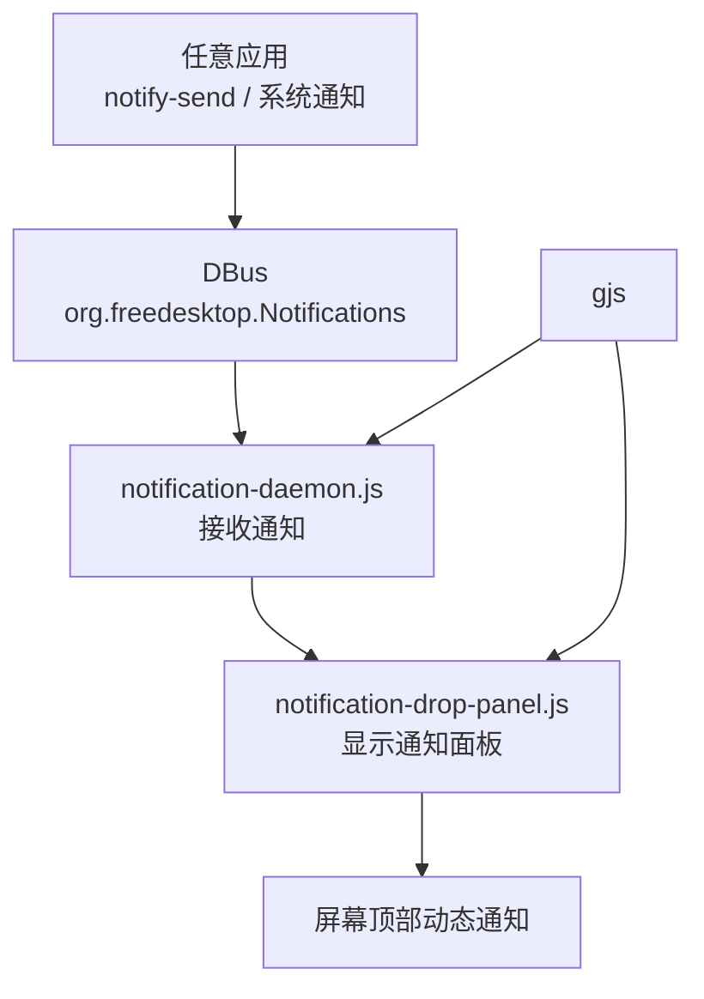

i3 启动时会先杀掉 `dunst`，再启动：

```text
~/.config/i3/notification-daemon.js
```

`notification-daemon.js` 负责接收通知，`notification-drop-panel.js` 负责显示通知界面。

通知不工作时，先看：

```text
/tmp/notification-daemon.log
~/.config/i3/notification-daemon.js
~/.config/i3/notification-drop-panel.js
```

## 终端：kitty

默认终端不是直接运行 `kitty`，而是：

```text
~/.config/kitty/kitty-random.sh
```

流程如下：

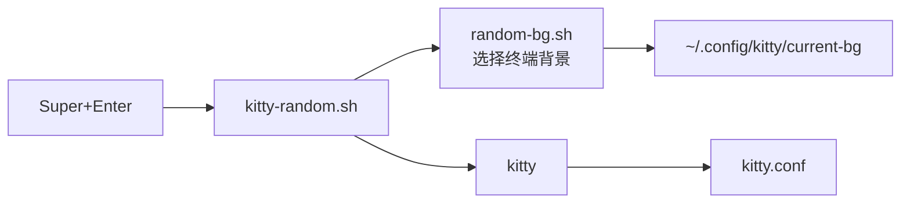

下拉终端是另一条链：


终端打不开时，先看：

```text
~/.config/kitty/kitty-random.sh
~/.config/kitty/random-bg.sh
~/.config/kitty/kitty.conf
```

下拉终端异常时，先看：

```text
~/.config/i3/dropdown-terminal.sh
i3 config 里的 kitty-dropdown 规则
```

## 显示器和工作区

这部分最容易混乱。可以先看这张图：

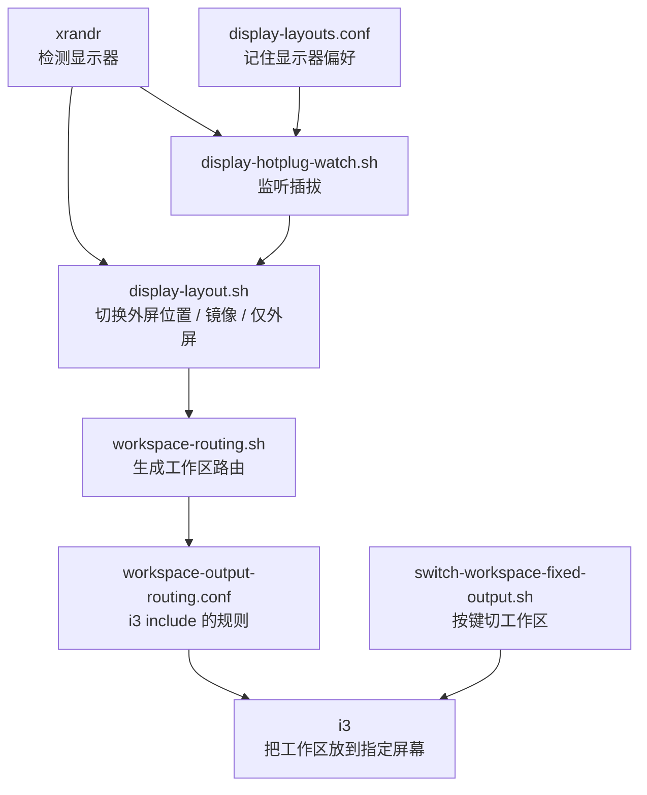

相关文件：

| 文件 | 作用 |
| --- | --- |
| `display-layout.sh` | 手动切换外屏在左/右/上、仅外屏、镜像、仅内屏 |
| `display-hotplug-watch.sh` | 监听显示器插拔，自动恢复布局 |
| `workspace-routing.sh` | 根据当前显示器生成工作区输出规则 |
| `switch-workspace-fixed-output.sh` | 按工作区编号切换，并把工作区放到预期屏幕 |
| `workspace-output-routing.conf` | 运行时生成的 i3 workspace output 规则 |
| `display-layouts.conf` | 运行时保存的显示器布局偏好 |

这两个文件是本机状态，不应该提交到 Git：

```text
workspace-output-routing.conf
display-layouts.conf
```

仓库里只保留 `*.example` 作为模板。

工作区跑错屏幕时，先看：

```text
~/.config/i3/workspace-routing.sh
~/.config/i3/workspace-output-routing.conf
/tmp/workspace-routing.log
```

插拔显示器后布局不对时，先看：

```text
~/.config/i3/display-hotplug-watch.sh
~/.config/i3/display-layout.sh
/tmp/display-hotplug-watch.log
```

## 托盘和系统辅助

这些不是视觉核心，但会让桌面更完整。

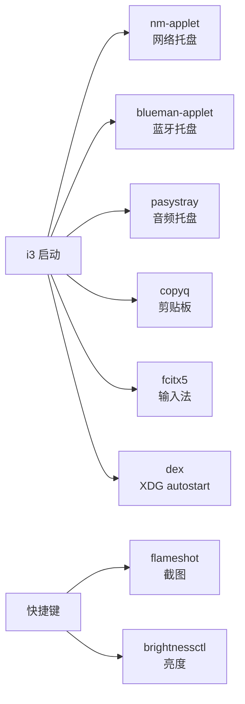

这些缺失时，桌面主体仍然能跑，但对应功能会不可用。

## 排查流程图

遇到问题时，不要先乱改配置。先判断问题属于哪一层。

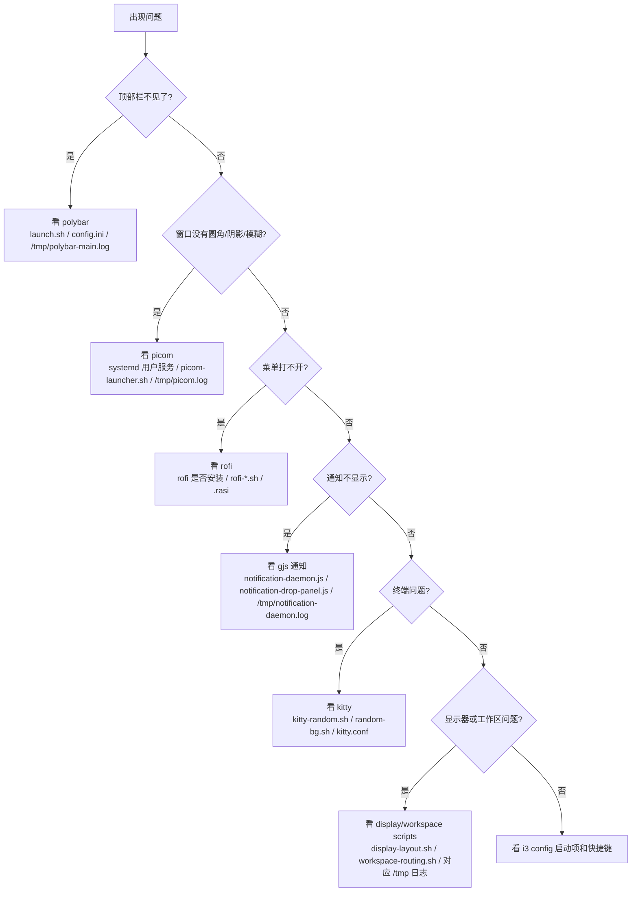

快速表格：

| 现象 | 先看哪里 |
| --- | --- |
| 顶部栏没有了 | `polybar/launch.sh`、`polybar/config.ini`、`/tmp/polybar-main.log` |
| 窗口没有圆角/阴影 | `systemctl --user status picom.service picom-power-watch.service`、`picom-launcher.sh`、`picom-full.conf`、`/tmp/picom.log` |
| 壁纸没设置 | `feh`、`themes/beige/wallpaper.png` |
| rofi 菜单打不开 | `rofi` 是否安装、对应 `rofi-*.sh` |
| 通知不显示 | `notification-daemon.js`、`notification-drop-panel.js`、`/tmp/notification-daemon.log` |
| 终端打不开 | `kitty-random.sh`、`kitty.conf` |
| 下拉终端不对 | `dropdown-terminal.sh`、i3 里的 `kitty-dropdown` 规则 |
| 工作区跑错屏幕 | `workspace-routing.sh`、`workspace-output-routing.conf` |
| 插拔显示器后布局不对 | `display-hotplug-watch.sh`、`display-layout.sh` |
| Wi-Fi 菜单不工作 | `nmcli`、`rofi-wifi-menu.sh` |
| 电源模式不显示 | `powerprofilesctl`、`polybar/scripts/power-profile.sh` |

## 最后再记一次

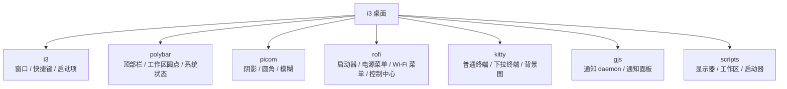

先按“问题属于哪一块”定位 app，再看对应脚本和日志。不要一上来就改所有配置。
